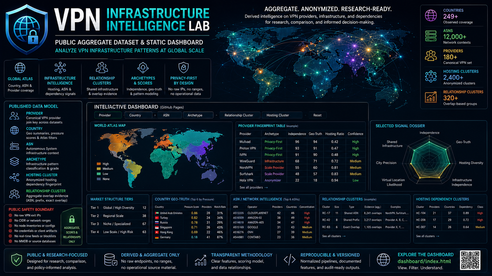

# VPN Infrastructure Intelligence Lab

Public aggregate dataset and static dashboard for analyzing VPN infrastructure patterns.

  

The repository presents derived infrastructure intelligence at provider, country, ASN, relationship, archetype, and anonymized hosting-cluster levels. The published data is designed for research, comparison, and visual exploration without exposing raw endpoint inventories or operational source material.

## Published Data Model

The public dataset is organized around a canonical VPN provider set.

Core entities:

- **Provider**: normalized VPN provider name used as the main join key across provider-level datasets.
- **Country**: full country name used for public geo summaries and dashboard filtering.
- **ASN**: public autonomous system number and operator label, shown only as aggregate infrastructure context.
- **Archetype**: provider infrastructure pattern derived from geography, hosting diversity, concentration, and confidence signals.
- **Hosting cluster**: anonymized hosting/operator fingerprint used to show dependency patterns without naming raw endpoint infrastructure.
- **Relationship cluster**: provider grouping based on aggregate overlap evidence such as shared ASN, shared prefix, or exact-overlap counts from aggregate source layers.

## Dataset Files

Provider-level files:

- `data/provider_fingerprints.csv`: provider infrastructure model, observed-record bucket, geography breadth, hosting diversity, shared-infrastructure score, hosting ratio, MMDB country-match rate, and confidence.
- `data/provider_geo_truth_score.csv`: provider geo-truth score, observed country count, MMDB match rate, virtual-location likelihood, city precision quality, and confidence.
- `data/provider_independence_index.csv`: provider independence score, grade, hosting concentration, shared-footprint level, geo-diversity level, and confidence.
- `data/provider_archetype_map.csv`: provider-to-archetype mapping with grade, geo-truth score, and confidence.

Country and geo files:

- `data/country_virtual_location_pressure.csv`: country-level pressure score, provider count, hosting-cluster count, provider examples, hosting dependency, MMDB match rate, and confidence.
- `data/provider_country_map.csv`: provider-to-country aggregate mapping with observed-record bucket and provider-country share.

Infrastructure and dependency files:

- `data/hosting_dependency_index.csv`: anonymized hosting clusters with provider count, country count, dependency score, dependency class, and public examples.
- `data/provider_hosting_cluster_map.csv`: provider-to-hosting-cluster mapping.
- `data/external_hosting_operator_footprint.csv`: aggregate operator footprint layer with normalized provider examples.
- `data/external_provider_hosting_dependency.csv`: provider-to-operator aggregate dependency signals.

ASN and Atlas files:

- `data/atlas_provider_country_asn.csv`: provider-country-ASN aggregate layer used by the dashboard map and Atlas filters.
- `data/atlas_provider_country.csv`: provider-country aggregate Atlas layer.
- `data/atlas_provider_asn.csv`: provider-ASN aggregate Atlas layer.
- `data/atlas_country_summary.csv`: country-level Atlas summary recalculated from the normalized provider-country-ASN layer.
- `data/atlas_asn_summary.csv`: ASN-level Atlas summary recalculated from the normalized provider-country-ASN layer.
- `data/external_asn_multi_provider_clusters.csv`: multi-provider ASN contexts after normalization to the canonical VPN provider set.

Relationship and structure files:

- `data/external_provider_overlap_signals.csv`: pair-level aggregate overlap signals.
- `data/external_provider_relationship_clusters.csv`: provider relationship clusters with aggregate evidence counts.
- `data/external_shared_prefix_evidence.csv`: anonymized shared-prefix evidence clusters.
- `data/infrastructure_archetypes.csv`: archetype summaries and median signal values.
- `data/market_structure_tiers.csv`: provider count and description for market-structure tiers.
- `data/methodology_features.csv`: feature descriptions used by the public scoring layer.

Repository summary:

- `data/providers_public.csv`: public provider fingerprint export.
- `data/public_summary.json`: generated public summary, source counts, exclusion boundary, and validation context.

## Relationships Between Files

Main joins:

- `provider` joins provider-level files, provider-country maps, provider-hosting maps, Atlas provider files, and external provider dependency layers.
- `country` joins country pressure data, provider-country maps, Atlas country summaries, and dashboard country filters.
- `asn` joins Atlas ASN summaries, provider-ASN rows, provider-country-ASN rows, and ASN context panels.
- `hosting_cluster` joins `hosting_dependency_index.csv` with `provider_hosting_cluster_map.csv`.
- `archetype` joins `infrastructure_archetypes.csv` with `provider_archetype_map.csv`.
- `relationship_cluster` identifies aggregate provider relationship groups in `external_provider_relationship_clusters.csv`.

The dashboard applies these relationships interactively. Selecting a provider, country, ASN, archetype, relationship cluster, or hosting cluster recalculates the visible provider table, Atlas map, ASN context, country lists, relationship panels, and hosting dependency tables.

## Dashboard

The GitHub Pages entry point is the interactive dashboard:

- Root page: `index.html`
- Dashboard app: `dashboard/index.html`
- Dashboard data source: `data/`

The dashboard includes:

- world Atlas map
- unified filters
- provider fingerprint table
- selected-signal dossier
- market structure tiers
- infrastructure archetypes
- country geo-truth list
- ASN/network intelligence
- provider relationship clusters
- hosting dependency clusters

## Public Safety Boundary

The repository does not publish:

- raw VPN exit IP addresses
- endpoint or node inventories
- CIDR/network range lists
- OpenVPN or WireGuard configuration files
- credentials, tokens, or provider client artifacts
- MMDB/source databases
- real-time detection feeds or blocklists

The public layer contains aggregates, scores, examples, buckets, and anonymized cluster identifiers only.

## Interpretation and Legal Context

Scores and clusters are analytical infrastructure signals. They are not accusations, legal conclusions, ownership claims, affiliation claims, abuse determinations, or provider verdicts.

Provider independence, geo-truth, relationship, and dependency scores describe observed infrastructure patterns within the available aggregate data. They do not establish corporate control, intent, jurisdiction, service quality, user safety, malicious activity, or legal responsibility.

Country labels represent observed or enriched infrastructure geography in the aggregate dataset. They are not statements about company jurisdiction, physical office location, ownership, or legal domicile.

ASN and operator labels are used as infrastructure context only. They do not imply endorsement, wrongdoing, control, cooperation, or responsibility by the named network operator.

The dataset is suitable for research, comparative analysis, methodology discussion, and visual exploration. It is not a substitute for legal review, incident response evidence, compliance decisions, or live security enforcement.
